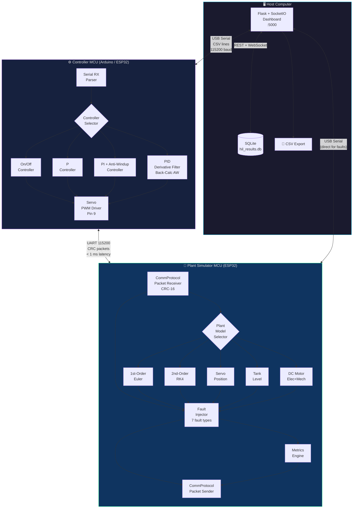
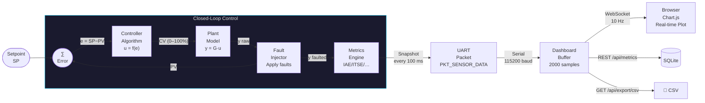
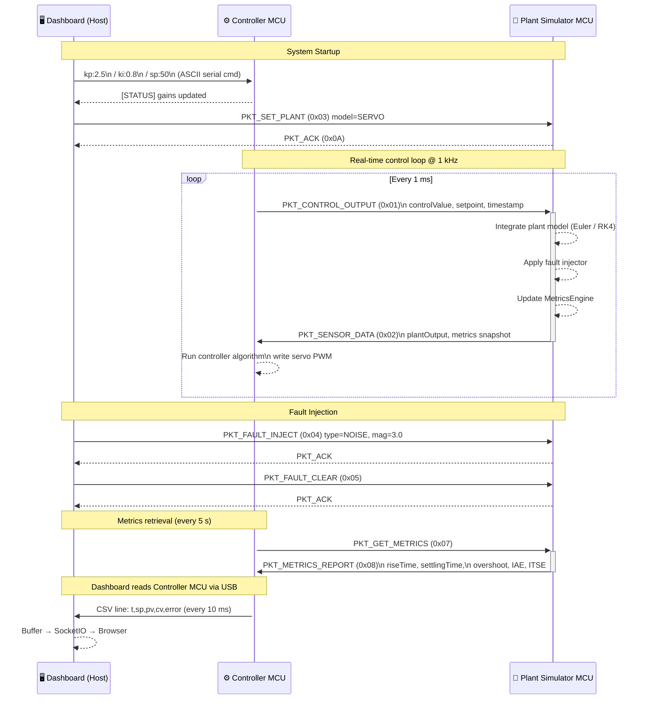
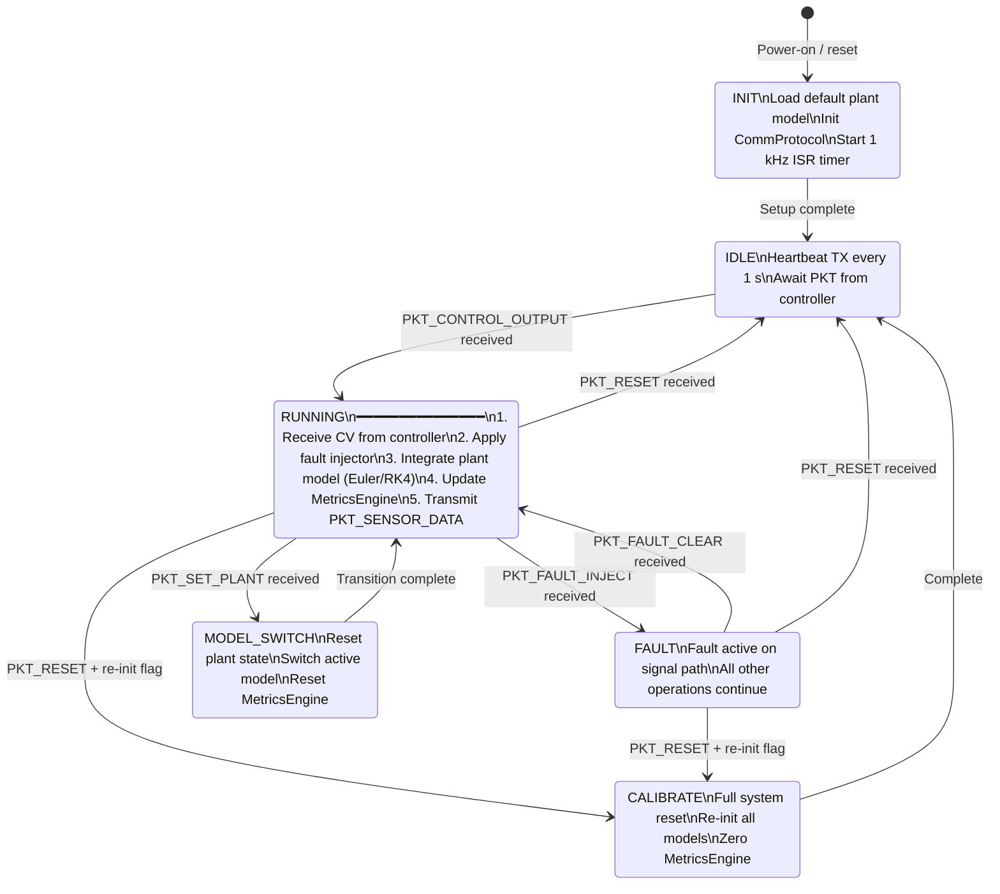
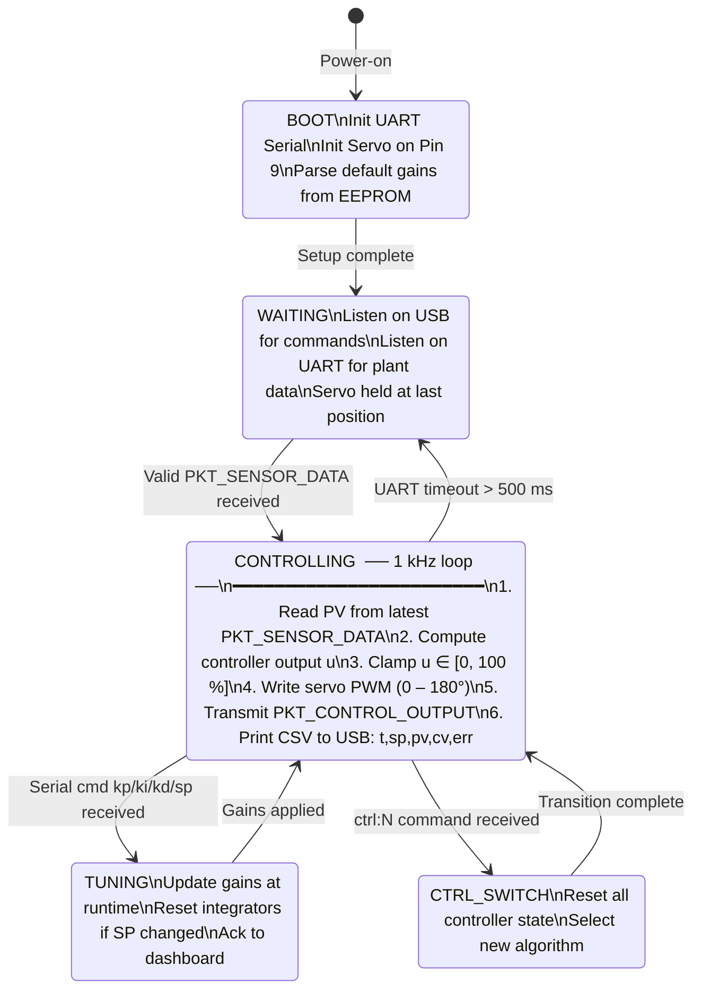
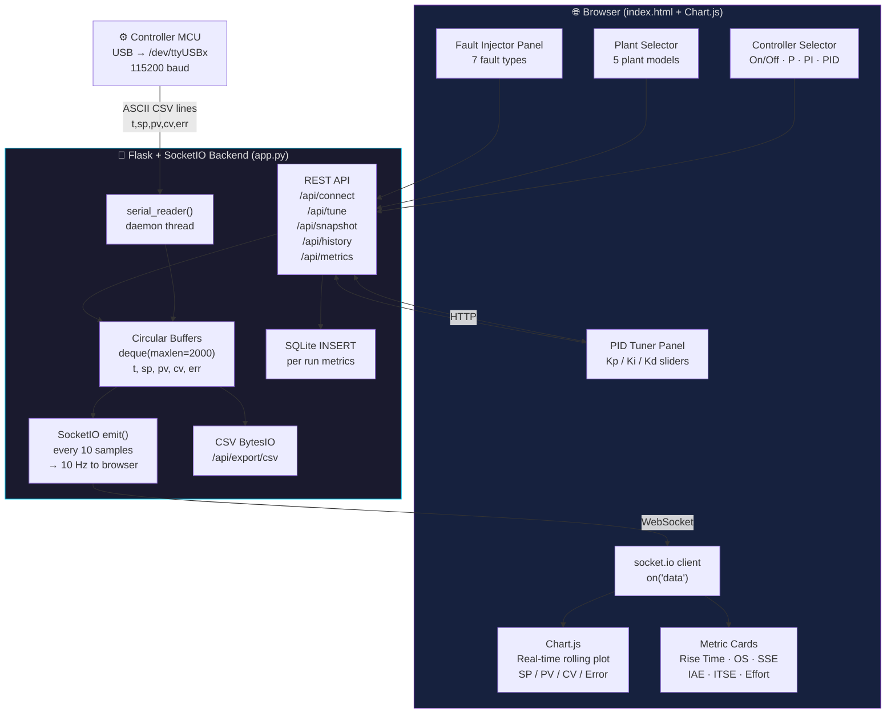
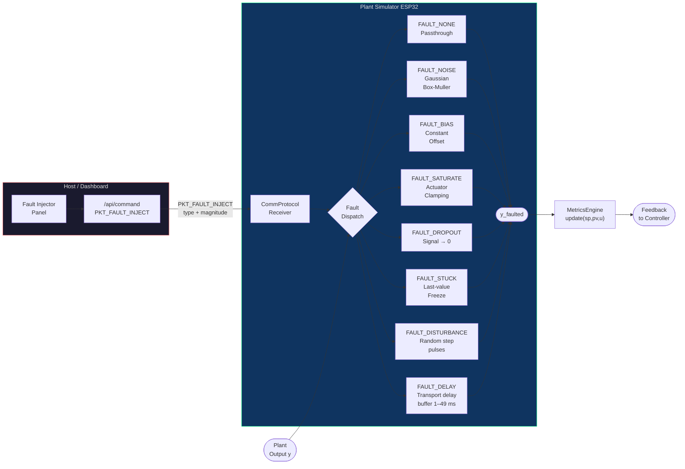
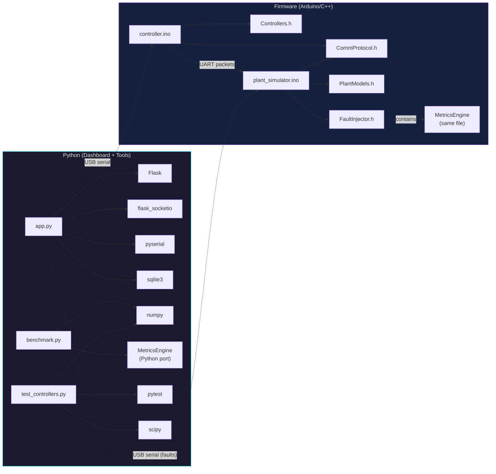

# 🏗️ System Architecture — HIL Servo Control Testbed

> All diagrams use Mermaid syntax and render natively on GitHub.
> Dark-theme colours chosen for visibility on both light and dark backgrounds.

---

## 1. System Architecture Diagram

---

## 2. Data Flow Diagram

---

## 3. UART Packet Flow Diagram

---

## 4. Plant Simulator State Machine

---

## 5. Controller MCU State Machine

---

## 6. Dashboard Data Pipeline Diagram

---

## 7. Fault Injection Architecture Diagram

---

## Component Dependency Map

---

*Diagrams generated for the HIL Servo Control Testbed project — paste any block directly into a GitHub README or `ARCHITECTURE.md`.*
